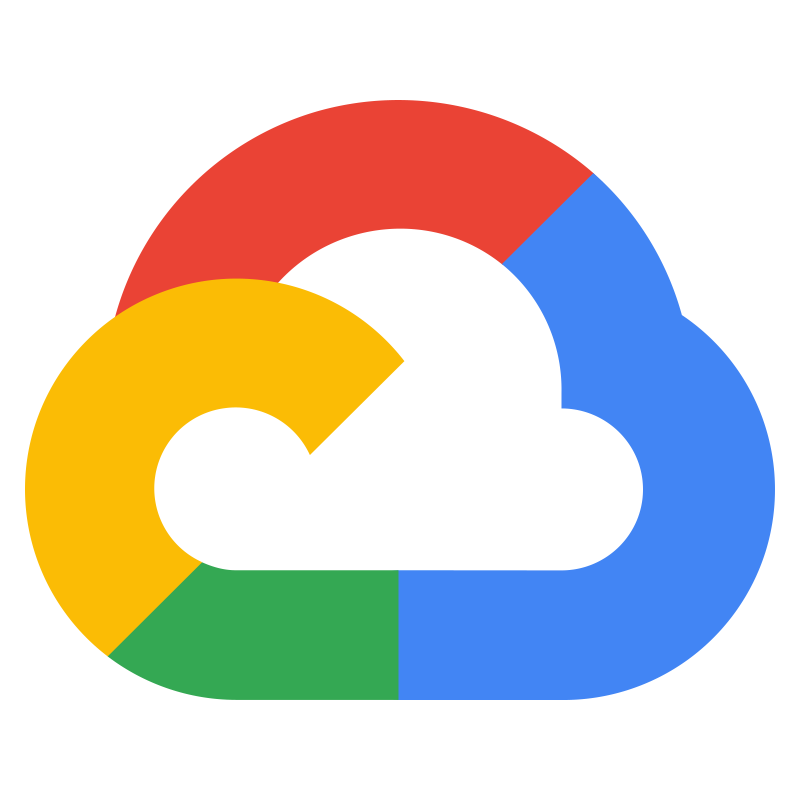

<div align="center">
  
  
  # Cloud Engineer Roadmap
  
  <p><strong>A comprehensive, interactive guide to becoming a Cloud Engineer</strong></p>

  <p>
    <b>English</b> | <a href="./README.id.md">Indonesia</a>
  </p>

  <a href="https://roadmapcloud.vercel.app">
    
  </a>
</div>

<br />

## 🌐 About This Project
This website is a complete interactive guide for anyone who wants to learn how to become a **Cloud Engineer**. Compiled from a trusted curriculum and open sources, this roadmap guides you step-by-step through popular cloud platforms such as **Google Cloud Platform (GCP)**, **AWS**, **Azure**, and **Kubernetes**.

This application is built using **Next.js**, supports **PWA (Progressive Web App)** functionality so it can be installed directly to your phone/desktop, and comes with automatic bilingual support (**English** & **Indonesia**).

---

## 🚀 How to Use
You can directly access and use this web app at:
👉 **[https://roadmapcloud.vercel.app](https://roadmapcloud.vercel.app)**

1. **Language Selection:** The web app will automatically detect your device's language (ID/EN). You can manually change it via the **EN | ID** button in the top right corner.
2. **Mobile Navigation:** There is a *Bottom Navigation Bar* on mobile. Click the **Learn** 📖 icon to explore the material, and **Practice** 💻 to view real-world project scenarios.
3. **Native App (PWA):** Add this website to your home screen (*Add to Home Screen*) so you can access it anytime just like a native app.

---

## 🛠️ Clone, Fork, & Modify (It's Free!)
This project is fully **OPEN SOURCE**!
You are completely **Free and Allowed** to **Clone**, **Fork**, or **Modify** it to be as awesome as you want! Feel free to add new curriculums, change the design, or use it as a template for roadmaps in other fields.

If you want to run it locally on your computer:
```bash
# 1. Clone this repository
git clone https://github.com/dbasitbdw/Roadmap-Cloud-Engineer.git

# 2. Go into the project folder
cd Roadmap-Cloud-Engineer

# 3. Install dependencies
npm install

# 4. Run the development server
npm run dev
```
Open `http://localhost:3001` in your browser!

---

## 📄 Licenses

### ⚖️ MIT License
The source code for this project is released under the **MIT License**.
You are granted full and unrestricted rights to use, copy, modify, merge, publish, and distribute this project for any purpose (personal or commercial), provided that the original copyright notice is retained.

### ☁️ Logo License (Google Cloud)
The **Google Cloud** logo used as the favicon and icon for this project is a registered trademark of **Google LLC**. Its use in this project is strictly for **educational, identification, and illustrative purposes** without any claim of official affiliation, sponsorship, or direct endorsement by Google. Please adhere to [Google's Trademark Guidelines](https://about.google/brand-resource-center/) if you plan to distribute or commercialize this logo beyond personal/educational use.
